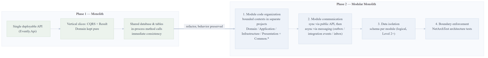
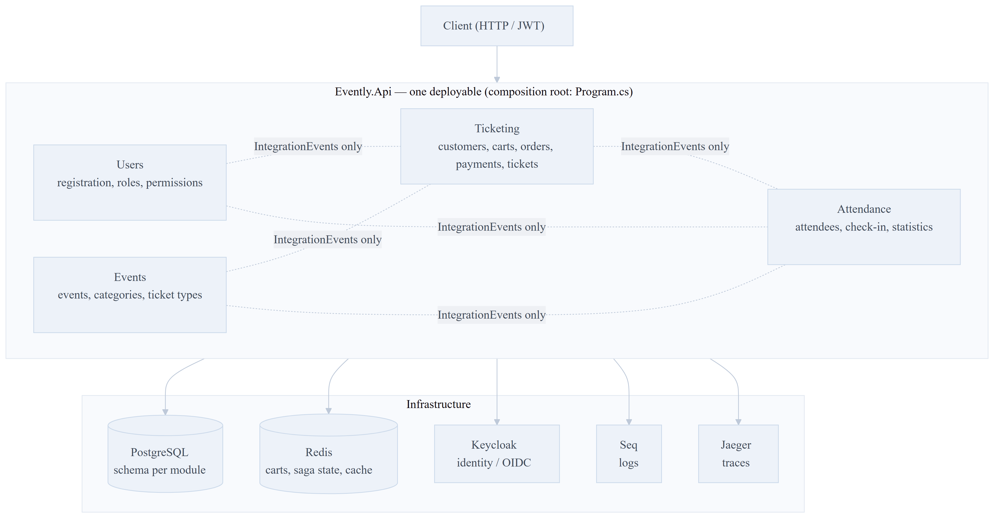
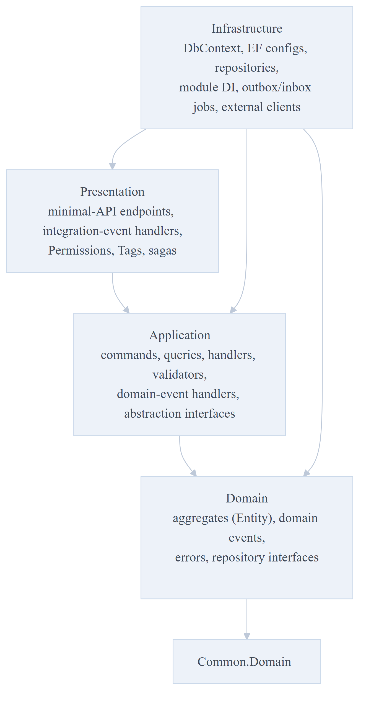
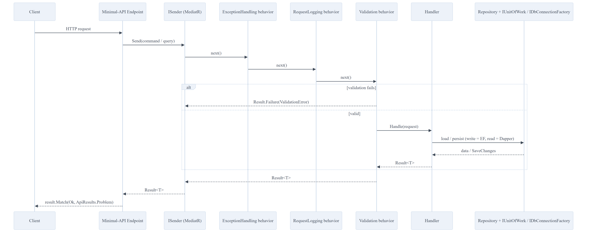
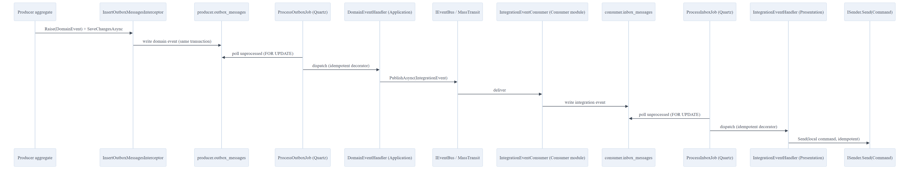
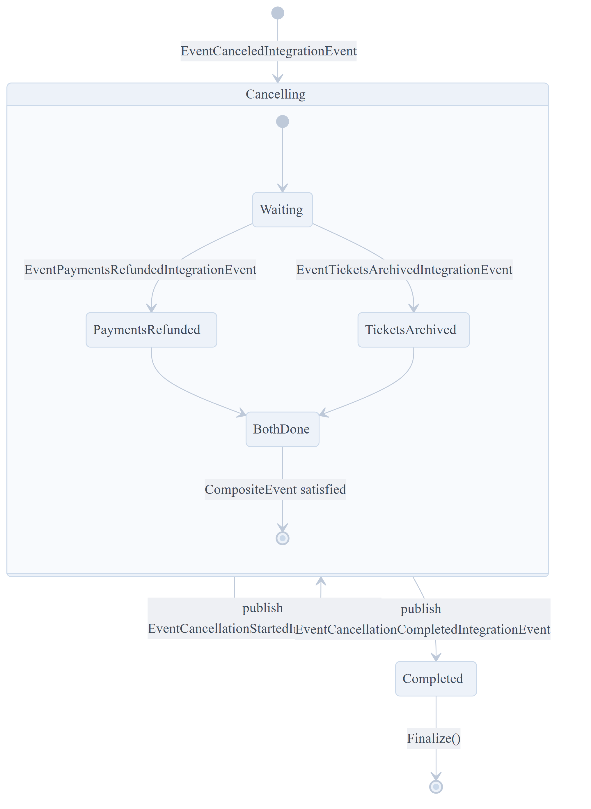
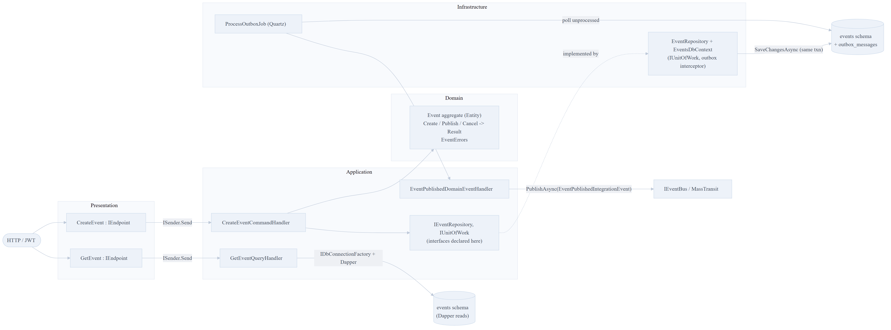

# Evently — Architecture Reference

> The design we are building toward, and the patterns to follow when implementing a slice.
> Based on the *Modular Monolith Architecture* course, adapted to **.NET 10**.
>
> The architecture — layering, module isolation, CQRS, outbox/inbox, the Result pattern — is
> framework-agnostic and applies as written. This doc is the **"what"**; the **"why"** behind
> each significant choice is an ADR in [`../ADRs/`](../ADRs/README.md), and course departures
> are logged in [`../deviations-from-author.md`](../deviations-from-author.md).
>
> First drafted 2026-08-30. Update it as our implementation takes shape and as decisions land.

## Build approach — monolith first, then modular

We build Evently in **two phases**, following the *Monolith First* movement (Fowler) and the
course's *Modularize Your Monolith* path. This document describes the **Phase 2 target
architecture**; we arrive there by evolving a working monolith, not by scaffolding the full
modular structure up front.



*Source: [`phase-roadmap.mmd`](../mermaid-diagrams/phase-roadmap.mmd).*

- **Phase 1 — Monolith.** One deployable (`src/API/Evently.Api`), features built as vertical
  slices with **CQRS + the `Result` pattern** and a **pure Domain**. The four bounded contexts
  (Users, Events, Ticketing, Attendance) exist as **folders**, not separate projects. Shared
  database and tables, in-process method calls, immediate consistency. Module isolation,
  integration events, per-schema data, and isolation architecture tests are **not** enforced
  yet.
- **Phase 2 — Modular Monolith.** Refactor the monolith into isolated modules while preserving
  behavior, in the course's order: **(1)** module code organization (separate
  Domain/Application/Infrastructure/Presentation projects + `Common.*`), **(2)** module
  communication — synchronous via a public API, then asynchronous via messaging
  (outbox → integration events → inbox), **(3)** data isolation — a **schema per module**
  (logical isolation, at least Level 2), **(4)** boundary enforcement — **NetArchTest**
  architecture tests.

The rules (R1–R10) are tagged **[Phase 1]** (binding now — Domain purity, CQRS/`Result`,
naming, style, testing) or **[Phase 2]** (the module-isolation and cross-module-messaging
rules — R1, R7, per-schema persistence — which apply once we start modularizing). See
`.claude/rules/evently-engineering-rules.md`.

### Diagrams

Rendered PNGs live in [`../images/`](../images); the Mermaid sources are in
[`../mermaid-diagrams/`](../mermaid-diagrams). Regenerate the PNGs after editing a source with
`pwsh scripts/export-mermaid.ps1` (renders every `.mmd` at scale 3 / width 1600 so text stays
crisp on wide diagrams). Each diagram is embedded in its most relevant section below.

We think about the diagrams in **[C4 model](https://c4model.com/)** levels — Context (L1),
Container (L2), Component (L3), Code (L4) — though we draw them as styled flowcharts, not C4
notation, to keep the set consistent.

| Diagram | C4 | Rendered | Source | Phase |
|---|---|---|---|---|
| Build roadmap (monolith → modular) | — | [PNG](../images/phase-roadmap.png) | [mmd](../mermaid-diagrams/phase-roadmap.mmd) | both |
| System shape / context | L1 + L2 | [PNG](../images/system-context.png) | [mmd](../mermaid-diagrams/system-context.mmd) | 2 |
| Per-module layering | L2 (internal) | [PNG](../images/module-layering.png) | [mmd](../mermaid-diagrams/module-layering.mmd) | 1→2 |
| Events module components | **L3** | [PNG](../images/c4-component-events.png) | [mmd](../mermaid-diagrams/c4-component-events.mmd) | 1→2 |
| CQRS request pipeline | L4 | [PNG](../images/cqrs-pipeline.png) | [mmd](../mermaid-diagrams/cqrs-pipeline.mmd) | 1 |
| Outbox/inbox cross-module messaging | L4 | [PNG](../images/outbox-inbox-messaging.png) | [mmd](../mermaid-diagrams/outbox-inbox-messaging.mmd) | 2 |
| Cancel-event saga | L4 | [PNG](../images/saga.png) | [mmd](../mermaid-diagrams/saga.mmd) | 2 |

A structural change (new module, new cross-cutting component, a boundary moving) must land
with its diagram updated and, if it's a real decision, an [ADR](../ADRs/README.md).

## What this covers

1. System shape — modules, project layout per module
2. The enforced rules (layering, module isolation, naming, sealing, ctor rules)
3. The CQRS request pipeline (MediatR, `Result<T>`, the three behaviors)
4. Domain modeling conventions
5. Persistence (schema per module, write path vs read path)
6. Cross-module communication — domain events, outbox, integration events, inbox, sagas
7. Composition root
8. Security (Keycloak, permission-based authorization)
9. Observability & scheduling
10. Testing strategy (architecture / unit / integration)
11. Build, style & tooling constraints
12. Anatomy of one vertical slice — the shape to copy
13. Glossary of the key abstractions

---

## 1. System shape



> Phase 2 target. In Phase 1 the four contexts are folders in one project; the layering still
> holds as folder boundaries. Sources:
> [`system-context.mmd`](../mermaid-diagrams/system-context.mmd),
> [`module-layering.mmd`](../mermaid-diagrams/module-layering.mmd).

**One deployable** — `src/API/Evently.Api` — hosting **four modules** that are isolated at the assembly and database-schema level but run in one process and one database.

```
Evently.Api (composition root: Program.cs)
├── Users        — registration, profile, roles/permissions, Keycloak sync
├── Events        — events, categories, ticket types (the "catalog")
├── Ticketing     — customers, carts, orders, payments, tickets
└── Attendance    — attendees, check-in, event statistics
        each module ↓
   Domain → Application → Infrastructure → Presentation   (+ IntegrationEvents contract)
```

### Per-module project layout (Events shown; all four are identical in shape)



| Project | References | Contains |
|---|---|---|
| `*.Domain` | `Common.Domain` only | Aggregates (`Entity`), domain events, `*Errors` static classes, repository **interfaces**, enums/value objects |
| `*.Application` | `Common.Application`, own `Domain`, own `IntegrationEvents` | Commands, queries, handlers (`internal sealed`), validators, domain-event handlers, response DTOs, abstraction interfaces (`IUnitOfWork`, `ICustomerContext`, `IPaymentService`, `IIdentityProviderService`) |
| `*.Infrastructure` | `Common.Infrastructure`, own `Application` + `Presentation` | `DbContext`, EF `IEntityTypeConfiguration`s, repository **implementations**, `XModule.cs` (DI), outbox/inbox jobs + idempotent decorators, external clients (Keycloak, Stripe-style payment) |
| `*.Presentation` | `Common.Presentation`, own `Application`, **other modules' `*.IntegrationEvents`** (consumed events + sagas) | Minimal-API endpoints (`IEndpoint`), integration-event handlers, `Permissions`, `Tags`, sagas |
| `*.IntegrationEvents` | `Common.Application` | **The only assembly other modules may reference.** Plain event classes (`public sealed : IntegrationEvent`, primitives only) + models. |
| `*.UnitTests` | own `Domain` only | Aggregate behavior — factory / invariant / state-transition results, `AssertDomainEventWasPublished<T>` |
| `*.IntegrationTests` | whole module + `Evently.Api` | Testcontainers (Postgres + Redis), real DB, `ISender`-driven |
| `*.ArchitectureTests` | whole module | NetArchTest rules |

`AssemblyReference.cs` (a `public static Assembly` marker) exists in Application and Presentation so the host and tests can scan those assemblies by type reference instead of string.

---

## 2. The enforced rules (from the architecture tests)

These are **executable** — they run in CI as xUnit tests using NetArchTest. Treat them as the contract.

### Layering (per module — `LayerTests`)
- Domain **must not** depend on Application or Infrastructure. (Domain → Presentation is not
  tested — it is structurally impossible, since Presentation references Application.)
- Application **must not** depend on Infrastructure or Presentation.
- Presentation **must not** depend on Infrastructure.
- (Infrastructure is the composition layer and may see everything in its own module.)

### Module isolation (solution-level — `Evently.ArchitectureTests/ModuleTests`)
- A module's four assemblies (`Domain`, `Application`, `Presentation`, `Infrastructure`) **must not** depend on any **other** module's namespace…
- …**except** that assembly may depend on another module's `*.IntegrationEvents` namespace. That is the *only* sanctioned cross-module reference.

### Domain (`DomainTests`)
- Types implementing `IDomainEvent` / inheriting `DomainEvent` → **sealed**, name ends `DomainEvent`.
- Types inheriting `Entity` → have a **private parameterless** constructor, and **only private** constructors.

### Application (`ApplicationTests`)
- `ICommand` / `ICommand<T>` → sealed, name ends `Command`.
- `IQuery<T>` → sealed, name ends `Query`.
- Command/query handlers → **not public** (`internal`), **sealed**, name ends `CommandHandler` / `QueryHandler`.
- `AbstractValidator<T>` → not public, sealed, name ends `Validator`.
- Domain-event handlers → not public, sealed, name ends `DomainEventHandler`.

### Presentation (`PresentationTests`)
- Integration-event handlers → not public, sealed, name ends `IntegrationEventHandler`.

---

## 3. Request handling — the CQRS pipeline



> Source: [`cqrs-pipeline.mmd`](../mermaid-diagrams/cqrs-pipeline.mmd). Applies from **Phase 1**.

Every use case is a MediatR request that returns a `Result` or `Result<T>`.

```
HTTP endpoint (minimal API)
  → ISender.Send(command/query)
    → ExceptionHandlingPipelineBehavior   (wraps unhandled exceptions in EventlyException)
    → RequestLoggingPipelineBehavior      (structured logs + OpenTelemetry tags, per module)
    → ValidationPipelineBehavior          (FluentValidation; failures → Result.Failure(ValidationError), no throw)
    → Handler
  → Result<T>
→ result.Match(Results.Ok, ApiResults.Problem)   → 200 or RFC 7231 ProblemDetails
```

**Registration** (`ApplicationConfiguration.AddApplication`): MediatR scans all module Application assemblies; the 3 behaviors are registered as open generics in that exact order; FluentValidation validators (including internal) are scanned from the same assemblies.

### Commands (write side)
`internal sealed class XCommandHandler(deps…) : ICommandHandler<XCommand, TResult>`
- Load aggregate(s) via **repository interface** (`IEventRepository.GetAsync`).
- Guard preconditions → return `Result.Failure<T>(SomeErrors.Xyz)` early.
- Call the aggregate's **factory or behavior method**, which itself returns `Result` and raises domain events.
- `repository.Insert(entity)` then `await unitOfWork.SaveChangesAsync(ct)`.
- `IUnitOfWork` is the module's `DbContext` (registered as `services.AddScoped<IUnitOfWork>(sp => sp.GetRequiredService<XDbContext>())`).

### Queries (read side)
`internal sealed class XQueryHandler(IDbConnectionFactory f) : IQueryHandler<XQuery, TResponse>`
- Opens a `DbConnection` and runs **hand-written SQL with Dapper**. No EF on the read path.
- Column aliases use `nameof(Response.Prop)` in raw string literals so renames stay compiler-checked.
- Returns `Result.Failure<T>(XErrors.NotFound(id))` when the row is absent (implicit conversion from `T?` → `Result<T>` handles the happy path).

### The Result / Error model
- `Result` / `Result<T>` — `IsSuccess`, `Error`. Accessing `.Value` on a failure throws (programmer error).
- `Error(Code, Description, ErrorType)` where `ErrorType ∈ {Failure, Validation, Problem, NotFound, Conflict}`.
- Errors are **defined once** as `static` members / factory methods in `Domain/<Aggregate>/<Aggregate>Errors.cs` (e.g. `EventErrors.NotFound(id)`, `EventErrors.NotDraft`).
- `ApiResults.Problem` maps `ErrorType` → HTTP status (400/404/409/500) + problem `type` URI; `ValidationError` carries a nested `errors` array.

---

## 4. Domain modeling conventions

`Event` aggregate is the canonical example:

- `public sealed class Event : Entity` with a **`private Event()`** constructor.
- All properties `{ get; private set; }`.
- Creation: `public static Result<Event> Create(...)` — validates invariants, `new Event { … }` via object initializer, `@event.Raise(new EventCreatedDomainEvent(@event.Id))`, returns the entity (implicit conversion to `Result<Event>`). A factory with **no** failure mode returns the entity directly instead (`Category.Create` → `Category`).
- State changes: instance methods (`Publish()`, `Cancel(utcNow)`) that check current state, return `Result` on rule violations, mutate, and `Raise(...)` a domain event — **or `void`** when the transition cannot fail (`Reschedule(...)`, `Category.Archive()`).
- Time is passed **in** (`Cancel(DateTime utcNow)`) or comes from `IDateTimeProvider` in the handler — never `DateTime.UtcNow` inside domain logic that needs testing.
- Domain events: `public sealed class <X>DomainEvent(<primitives>) : DomainEvent` — primary constructor, `{ get; init; }` properties, ids/primitives only. The base `DomainEvent()` fills `Id` + `OccurredOnUtc`. (Concrete events are **`sealed class`**, not records — same for integration events.)
- `Entity` keeps `_domainEvents`; `Raise` adds, `DomainEvents` exposes a copy, `ClearDomainEvents` empties (called by the outbox interceptor).

---

## 5. Persistence

- **PostgreSQL 17**, single database `evently`, **one schema per module** (`events`, `users`, `ticketing`, `attendance`).
- Each module: its own `DbContext : DbContext, IUnitOfWork`, `modelBuilder.HasDefaultSchema(Schemas.X)`, `UseSnakeCaseNamingConvention()`, per-schema `__EFMigrationsHistory` (`MigrationsHistoryTable(HistoryRepository.DefaultTableName, Schemas.X)`).
- Every module `DbContext.OnModelCreating` applies `OutboxMessageConfiguration`, `OutboxMessageConsumerConfiguration`, `InboxMessageConfiguration`, `InboxMessageConsumerConfiguration` plus its own entity configs.
- The `InsertOutboxMessagesInterceptor` (singleton) is added to every module's `DbContext` options.
- `DbSet`s are `internal`. EF configs and repositories are `internal sealed`.
- Migrations applied automatically in Development (`app.ApplyMigrations()`), which resolves every module `DbContext` and calls `Migrate()`.
- Read side gets connections from `IDbConnectionFactory` (over a shared `NpgsqlDataSource` singleton).
- **Carts** are the exception: stored only in Redis via `CartService` + `ICacheService`, 20-minute sliding expiration, key `carts:{customerId}`. No cart table.

---

## 6. Cross-module communication (the heart of the design)



> **Phase 2.** In Phase 1 these interactions are direct in-process method calls; this section is
> the target we refactor toward. Sources:
> [`outbox-inbox-messaging.mmd`](../mermaid-diagrams/outbox-inbox-messaging.mmd),
> [`saga.mmd`](../mermaid-diagrams/saga.mmd) (§6c).

Modules never call each other directly. Two async mechanisms, both backed by transactional in/outbox tables **per module**.

### 6a. Domain events (in-module, but the launchpad for integration events)

```
Handler saves aggregate
  → InsertOutboxMessagesInterceptor (SaveChangesAsync): pulls entity.DomainEvents,
    ClearDomainEvents(), serializes each to `<schema>.outbox_messages` IN THE SAME TRANSACTION
  → ProcessOutboxJob (Quartz, [DisallowConcurrentExecution], every 5s, batch 50,
    SELECT … WHERE processed_on_utc IS NULL ORDER BY occurred_on_utc LIMIT n FOR UPDATE)
      → deserialize → DomainEventHandlersFactory resolves IDomainEventHandler(s) from Application assembly
      → IdempotentDomainEventHandler<T> decorator: checks `outbox_message_consumers`
        (outbox_message_id, handler name); skips if present; runs decorated handler; records consumer
      → writes processed_on_utc / error back
```

Domain-event handlers (`internal sealed`) — a react/publish handler in the triggering
`Application/<Aggregate>/<UseCase>/` folder, a projection handler grouped under
`Application/<ReadModel>/Projections/` — do **one** of:
- **Update a projection / read model** via Dapper (e.g. Attendance `EventStatistics/Projections/*`).
- **Publish an integration event** via `IEventBus` (e.g. `EventPublishedDomainEventHandler` → builds `EventPublishedIntegrationEvent` from a `GetEventQuery` and publishes it).
- **Dispatch one in-module follow-up command** via `ISender` (e.g. Ticketing `OrderCreatedDomainEvent` → `CreateTicketBatchCommand`) — in-module choreography, not cross-module.

### 6b. Integration events (module → module)

```
IEventBus.PublishAsync(integrationEvent)   → MassTransit IBus.Publish
   MassTransit transport = IN-MEMORY (course default; RabbitMQ is a later swap)
      → consuming module's IntegrationEventConsumer<T> (MassTransit IConsumer):
        writes raw event to <schema>.inbox_messages
      → ProcessInboxJob (Quartz, same batch/FOR UPDATE pattern):
          → IntegrationEventHandlersFactory resolves IIntegrationEventHandler(s) from Presentation assembly
          → IdempotentIntegrationEventHandler<T> decorator: `inbox_message_consumers` guard
          → handler typically does ISender.Send(new SomeCommand(...))
```

Integration-event handlers live in **`*.Presentation`** (`internal sealed`, `*IntegrationEventHandler`). Example: Attendance's `EventPublishedIntegrationEventHandler` receives `Events.IntegrationEvents.EventPublishedIntegrationEvent` and sends Attendance's own `CreateEventCommand` — so each module keeps its own local copy of the data it needs.

Consumer registration: each consuming module's `XModule.ConfigureConsumers` calls
`registration.AddConsumer<IntegrationEventConsumer<TEvent>>()` for every event it consumes.
It is a `static void ConfigureConsumers(IRegistrationConfigurator)` (passed to `AddInfrastructure`
as a method group) — or, when it needs a parameter (the `CancelEventSaga`'s Redis connection),
a `static` factory returning `Action<IRegistrationConfigurator>`.

### 6c. Sagas (orchestrated multi-module workflows)



`CancelEventSaga` (`Events.Presentation`, a `MassTransitStateMachine<CancelEventState>`) coordinates event cancellation:
`EventCanceledIntegrationEvent` → publish `EventCancellationStartedIntegrationEvent` → wait for **both** `EventPaymentsRefundedIntegrationEvent` (Ticketing) and `EventTicketsArchivedIntegrationEvent` (Ticketing) via a `CompositeEvent` → publish `EventCancellationCompletedIntegrationEvent` → `Finalize()`.
Saga state persisted in **Redis** (`.RedisRepository(redisConnectionString)`).

---

## 7. Composition root (`Program.cs`)

Order matters:
1. Serilog from config.
2. `AddExceptionHandler<GlobalExceptionHandler>` + ProblemDetails.
3. Swagger.
4. `AddApplication(moduleApplicationAssemblies)` — MediatR + validators + behaviors.
5. `AddInfrastructure(serviceName, [module ConfigureConsumers…], dbConn, redisConn)` — auth, MassTransit, Quartz, Redis cache, OpenTelemetry, `NpgsqlDataSource`, `IEventBus`, outbox interceptor.
6. Health checks (Npgsql, Redis, Keycloak).
7. `AddModuleConfiguration(["users","events","ticketing","attendance"])` — loads `modules.<name>.json` (+ `.Development`).
8. `AddEventsModule` / `AddUsersModule` / `AddTicketingModule` / `AddAttendanceModule` — each registers its domain-event handlers (with idempotent decorator via Scrutor `.Decorate`), integration-event handlers, `DbContext` + repos + options, and endpoints.
9. Pipeline: migrations (dev) → health → trace-logging middleware → Serilog request logging → exception handler → authentication → authorization → `MapEndpoints()`.

---

## 8. Security

- **Keycloak** (`Evently.Identity`, realm imported from `.files/evently-realm-export.json`), OIDC + JWT bearer.
- `Common.Infrastructure/Authentication` — `JwtBearerConfigureOptions`, `CustomClaims`, `ClaimsPrincipalExtensions`.
- `Common.Infrastructure/Authorization` — **permission-based**: `PermissionAuthorizationPolicyProvider` + `PermissionAuthorizationHandler` + `PermissionRequirement`, `CustomClaimsTransformation` loads the user's permissions (from the Users module via `IPermissionService`, cached).
- Endpoints declare `.RequireAuthorization(Permissions.ModifyEvents)` where `Permissions` is an `internal static class` of string constants like `"events:update"`, `"ticket-types:read"`.
- Users module owns `User`/`Role`/`Permission` and syncs to Keycloak through `IIdentityProviderService` → `KeyCloakClient` (with `KeyCloakAuthDelegatingHandler`).

---

## 9. Observability & scheduling

- **Serilog** → console + **Seq** (`localhost:5341` / UI `:8081`). `LogContextTraceLoggingMiddleware` pushes trace/span IDs; `RequestLoggingPipelineBehavior` pushes `Module` + request name.
- **OpenTelemetry** — ASP.NET Core, HttpClient, EF Core, Redis, Npgsql, MassTransit instrumentation; **OTLP exporter** → **Jaeger** (`:4317`, UI `:16686`).
- **Quartz** hosted service runs the outbox and inbox jobs for every module (interval + batch from `modules.<name>.json`).

---

## 10. Testing strategy

| Layer | Project(s) | Tooling | What's covered |
|---|---|---|---|
| Architecture | per-module `…ArchitectureTests`, `test/Evently.ArchitectureTests` | NetArchTest + xUnit + FluentAssertions | Layering, module isolation, naming/sealing/visibility/ctor rules (§2) |
| Unit | per-module `…UnitTests` (references own `Domain` only) | xUnit, FluentAssertions, Bogus `Faker` | Aggregate behavior — factory / invariant / state-transition results, `AssertDomainEventWasPublished<T>` helper. No handlers. |
| Integration (per module) | per-module `…IntegrationTests` | xUnit collection fixture, `WebApplicationFactory<Program>`, **Testcontainers (Postgres + Redis)**, `IDateTimeProvider` mocked (NSubstitute) | Full slice via `ISender`. `BaseIntegrationTest` exposes `Sender` + the module `DbContext` + `CleanDatabaseAsync()` (ordered `DELETE`s, FK-safe). **No `Poller`, no Keycloak.** |
| Integration (cross-module) | `test/Evently.IntegrationTests` | same, **plus a Keycloak Testcontainer** | End-to-end flows spanning modules (e.g. register user → attendee created). `BaseIntegrationTest` exposes `Sender` only; adds **`Poller`** for eventual-consistency assertions. |

Test method naming: integration tests `Should_<Outcome>_When<Condition>`; unit tests are
method-prefixed — `<Method>_Should<Outcome>_When<Condition>` (e.g.
`Create_ShouldReturnFailure_WhenEndDatePrecedesStartDate`). AAA comments
(`// Arrange` / `// Act` / `// Assert`).

---

## 11. Build, style & tooling constraints

- **We target `net10.0`.** (The course material is on .NET 8 — see `docs/deviations-from-author.md`.) The architecture is framework-agnostic, so everything else in this section applies unchanged.
- `Nullable` enabled, `ImplicitUsings` enabled.
- **`TreatWarningsAsErrors` + `CodeAnalysisTreatWarningsAsErrors` + `EnforceCodeStyleInBuild` + `AnalysisMode=All` + `SonarAnalyzer.CSharp`** — a warning fails the build.
- `.editorconfig` (severity `error` on most): file-scoped namespaces; `using` outside namespace; System usings first; braces always; language keywords over BCL types; expression-bodied properties/accessors/operators/lambdas; `readonly` fields; no `this.`; no unused parameters; collection expressions (`[]`); `CA1515` (make public internal) disabled — public API surface is deliberately minimal, most types are `internal`.
- Primary constructors used pervasively for handlers/services (DI).
- JSON serialization for in/outbox uses **Newtonsoft** with `SerializerSettings.Instance` (`TypeNameHandling` for polymorphic `IDomainEvent`/`IIntegrationEvent`).

---

## 12. Anatomy of one vertical slice (copy this shape)



> Source: [`c4-component-events.mmd`](../mermaid-diagrams/c4-component-events.mmd). The write
> path (endpoint → command handler → aggregate → repository + `DbContext`, one
> `SaveChangesAsync`), the read path (endpoint → query handler → Dapper), and the
> domain-event → outbox → integration-event hop, in one module.

Feature: "Create Event" (a command). Files, in order of the dependency flow:

| # | File | Project | Rules |
|---|---|---|---|
| 1 | `Domain/Events/Event.cs` — `static Result<Event> Create(...)` + `Raise(new EventCreatedDomainEvent(Id))` | Domain | sealed, private ctor, invariants return `Result` |
| 2 | `Domain/Events/EventCreatedDomainEvent.cs` — `public sealed class EventCreatedDomainEvent(Guid eventId) : DomainEvent` (primary ctor, `{ get; init; }` prop) | Domain | sealed, `DomainEvent` suffix |
| 3 | `Domain/Events/EventErrors.cs` — `static Error StartDateInPast …` | Domain | one place for error definitions |
| 4 | `Application/Events/CreateEvent/CreateEventCommand.cs` — `sealed record CreateEventCommand(...) : ICommand<Guid>` | Application | sealed, `Command` suffix |
| 5 | `…/CreateEventCommandValidator.cs` — `internal sealed : AbstractValidator<CreateEventCommand>` | Application | internal, sealed, `Validator` suffix |
| 6 | `…/CreateEventCommandHandler.cs` — `internal sealed : ICommandHandler<CreateEventCommand, Guid>` | Application | internal, sealed; repo + `IUnitOfWork`; returns `Result<Guid>` |
| 7 | (optional) `…/<Event>DomainEventHandler.cs` — projection, `IEventBus.PublishAsync`, or one in-module `ISender.Send` | Application | internal, sealed, `DomainEventHandler` suffix |
| 8 | `Presentation/Events/CreateEvent.cs` — `internal sealed : IEndpoint`, `MapPost("events", …)`, `result.Match(Results.Ok, ApiResults.Problem)`, `.RequireAuthorization(Permissions.ModifyEvents)`, `.WithTags(Tags.Events)` | Presentation | internal, sealed; nested `Request` type |
| 9 | If other modules care: add `<Event>IntegrationEvent.cs` to `*.IntegrationEvents`; publish from the domain-event handler | IntegrationEvents | `public sealed class …: IntegrationEvent`, ctor chains `: base(id, occurredOnUtc)`, `{ get; init; }` props, primitives only |
| 10 | Tests: `UnitTests/Events/EventTests.cs` (aggregate), `IntegrationTests/Events/CreateEventTests.cs` (`ISender`) | tests | naming per §10 (unit `Create_Should…_When…`, integration `Should_…_When…`) |

A **query** slice is smaller: `Application/<Aggregate>/<UseCase>/<UseCase>Query.cs` (`sealed record : IQuery<T>`), `<UseCase>QueryHandler.cs` (`internal sealed`, Dapper via `IDbConnectionFactory`), `<X>Response.cs`, `Presentation/<UseCase>.cs`.

---

## 13. Glossary of the key abstractions

| Type | Project | Role |
|---|---|---|
| `Entity` | Common.Domain | Base for aggregates; owns domain events |
| `DomainEvent` / `IDomainEvent` | Common.Domain | In-module event; `sealed class` subclasses (primary ctor, `{ get; init; }`) |
| `Result` / `Result<T>` / `Error` / `ErrorType` / `ValidationError` | Common.Domain | Railway-oriented flow control |
| `ICommand` / `ICommand<T>` / `IQuery<T>` + handlers | Common.Application | CQRS contracts (MediatR) |
| `IDomainEventHandler<T>` / `DomainEventHandler<T>` | Common.Application | Reacts to domain events (in Application) |
| `IIntegrationEvent` / `IntegrationEvent` / `IIntegrationEventHandler<T>` | Common.Application | Cross-module contract (`sealed class : IntegrationEvent`, in `*.IntegrationEvents`) + reaction (handlers in Presentation) |
| `IEventBus` | Common.Application (impl in Infrastructure) | Thin wrapper over MassTransit `IBus.Publish` |
| `IUnitOfWork` | per-module Application | The module `DbContext`, for `SaveChangesAsync` |
| `IDbConnectionFactory` | Common.Application | Read-side raw connections (Dapper) |
| `ICacheService` | Common.Application | Redis / distributed cache |
| `IDateTimeProvider` | Common.Application | Testable clock |
| `IEndpoint` | Common.Presentation | One minimal-API endpoint; auto-discovered |
| `ApiResults.Problem` / `ResultExtensions.Match` | Common.Presentation | `Result` → `IResult` |
| `InsertOutboxMessagesInterceptor` | Common.Infrastructure | Domain events → outbox, same transaction |
| `ProcessOutboxJob` / `ProcessInboxJob` | per-module Infrastructure | Quartz dispatchers |
| `IdempotentDomainEventHandler<T>` / `IdempotentIntegrationEventHandler<T>` | per-module Infrastructure | Once-only delivery via consumer tables |
| `XModule` (`AddXModule`, `ConfigureConsumers`) | per-module Infrastructure | Module DI entry point |
